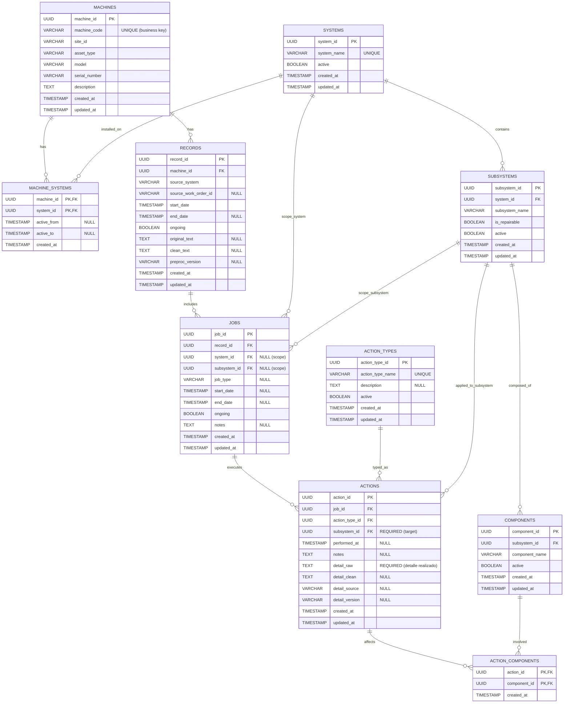

# docs/01_er_model.md

# Modelo ER: Mantenciones V2 (Machine → Systems → Subsystems → Components | Record → Jobs → Actions)

## Objetivo del modelo
Este ER modela mantenciones como un **data product**: trazable, auditado y listo para analítica/alertas. Separa explícitamente:
- **Catálogos (master data):** jerarquía técnica estable.
- **Transaccional (eventos):** lo que ocurre en el tiempo.
- **Gobernanza:** validaciones para no registrar trabajos/acciones fuera de la realidad de la máquina.
- **Serving contracts:** salidas estables (tablas/vistas) para consumo y alertas.

---

## Entidades y propósito

### 1) Catálogo técnico (jerarquía)
**SYSTEMS**
- Qué es: sistema “tipo” (Motor, Hidráulico, etc.)
- Rol: catálogo base para clasificar trabajos.

**SUBSYSTEMS**
- Qué es: subsistema dentro de un system.
- Relación: `SYSTEMS 1 — N SUBSYSTEMS`

**COMPONENTS**
- Qué es: componente dentro de un subsystem.
- Relación: `SUBSYSTEMS 1 — N COMPONENTS`

**Cardinalidad:**
`SYSTEMS → SUBSYSTEMS → COMPONENTS` define la composición técnica estándar.

---

### 2) Activos y configuración por activo
**MACHINES**
- Qué es: el equipo físico (activo).
- Rol: eje de todo el histórico.
- Llave de negocio: `machine_code` (se usa para filtrar/consumir).

**MACHINE_SYSTEMS** (tabla puente)
- Qué es: define qué sistemas están instalados/habilitados en cada máquina.
- Relación:
  - `MACHINES 1 — N MACHINE_SYSTEMS`
  - `SYSTEMS 1 — N MACHINE_SYSTEMS`
- PK compuesta: (`machine_id`, `system_id`)

**Por qué existe:** evita registrar trabajos en sistemas que esa máquina no tiene. Esto es gobernanza básica.

---

### 3) Transaccional: evento → trabajo → acción (con detalle realizado)
**RECORDS**
- Qué es: registro/evento (orden, ticket, intervención) asociado a una máquina.
- Grano: 1 fila por evento.
- Relación: `MACHINES 1 — N RECORDS`

**JOBS**
- Qué es: “unidad de trabajo” dentro del record. Agrupa acciones por alcance técnico.
- Grano: 1 fila por trabajo.
- Relación: `RECORDS 1 — N JOBS`
- Alcance técnico (scope):
  - `jobs.system_id` (opcional)
  - `jobs.subsystem_id` (opcional)
  - Regla: al menos uno debe venir (system y/o subsystem)

**ACTIONS**
- Qué es: ejecución concreta. Aquí se mide el “qué se hizo”, “dónde” y “cuándo”.
- Grano: 1 fila por acción.
- Relación: `JOBS 1 — N ACTIONS`
- Target técnico:
  - `actions.subsystem_id` **obligatorio** (toda acción opera al menos a nivel de subsistema).
- Detalle realizado (requerimiento de negocio):
  - `actions.detail_raw` **obligatorio** (texto/línea que describe lo realizado).
  - `detail_clean/source/version` opcionales para trazabilidad del extractor.

**ACTION_TYPES**
- Qué es: catálogo de tipos de acción (reemplazo, reparación, inspección, etc.)
- Relación: `ACTION_TYPES 1 — N ACTIONS`

**ACTION_COMPONENTS** (tabla puente)
- Qué es: componentes involucrados por acción.
- Grano: 1 fila por `(action_id, component_id)`.
- Relación:
  - `ACTIONS 1 — N ACTION_COMPONENTS`
  - `COMPONENTS 1 — N ACTION_COMPONENTS`
- Interpretación (regla acordada):
  - `component_count = 1` ⇒ acción a nivel **COMPONENT**
  - `component_count = 0` o `> 1` ⇒ acción a nivel **SUBSYSTEM**

---

## Reglas de negocio que el modelo implementa
1) Una máquina tiene varios sistemas
→ `MACHINES -> MACHINE_SYSTEMS -> SYSTEMS`

2) Un system tiene varios subsystems; cada subsystem tiene components
→ `SYSTEMS -> SUBSYSTEMS -> COMPONENTS`

3) Un record puede tener varios jobs sobre una máquina
→ `MACHINES -> RECORDS -> JOBS`

4) Un job implica actuar a nivel system y/o subsystem
→ `JOBS.system_id` y/o `JOBS.subsystem_id`

5) Un job tiene varias actions
→ `JOBS -> ACTIONS`

6) Cada action se aplica a nivel subsistema (siempre) y opcionalmente se asocia a 0..N componentes vía puente
→ `ACTIONS.subsystem_id` obligatorio, `ACTION_COMPONENTS` define componentes

7) Registro de acciones debe contener el detalle realizado
→ `ACTIONS.detail_raw` obligatorio

---

## Claves y constraints recomendadas (para que no se rompa)
**Integridad referencial (FKs)**
- `records.machine_id` → `machines.machine_id`
- `jobs.record_id` → `records.record_id`
- `actions.job_id` → `jobs.job_id`
- `actions.action_type_id` → `action_types.action_type_id`
- `actions.subsystem_id` → `subsystems.subsystem_id`
- `subsystems.system_id` → `systems.system_id`
- `components.subsystem_id` → `subsystems.subsystem_id`
- `machine_systems.machine_id` → `machines.machine_id`
- `machine_systems.system_id` → `systems.system_id`
- `action_components.action_id` → `actions.action_id`
- `action_components.component_id` → `components.component_id`

**Reglas semánticas (gobernanza)**
- JOB debe cumplir: `system_id IS NOT NULL OR subsystem_id IS NOT NULL`
- Si `jobs.subsystem_id` no es null, ese subsystem debe pertenecer al system (consistencia jerárquica) cuando ambos existen.
- ACTION debe cumplir:
  - `subsystem_id IS NOT NULL`
  - `detail_raw IS NOT NULL`
- COMPONENTES por acción:
  - `component_count = COUNT(DISTINCT action_components.component_id)`
  - `component_count = 1` ⇒ target_level = `COMPONENT`
  - `component_count = 0` o `> 1` ⇒ target_level = `SUBSYSTEM`
  - Si existe un `component_id` asociado, debe pertenecer al `actions.subsystem_id` (consistencia jerárquica).

**Control de configuración**
- Si `jobs.system_id` existe, debe existir (`machine_id`, `system_id`) en `machine_systems`.
- Si `jobs.subsystem_id` existe, su `system_id` debe existir en `machine_systems` para esa máquina.

---

## Convención de timestamp canónico (para filtros temporales)
Para consultas por período (serving):
- `event_ts = COALESCE(actions.performed_at, jobs.start_date, records.start_date)`

---

## Mermaid (referencia visual dentro del repo)


---

# Data Contracts (serving) — requerimientos de corto plazo

## 1) Tabla: fecha de cambios/mantenciones de componentes (todas las máquinas)
**Nombre:** `gold.fact_component_maintenance_changes`  
**Grano:** 1 fila por `(action_id, component_id)` **solo** cuando `component_count = 1` (nivel COMPONENT).  
**Partición recomendada:** `change_date`.

**Columnas principales**
- `change_date` DATE
- `event_ts` TIMESTAMP
- `machine_id` UUID
- `machine_code` VARCHAR
- `record_id` UUID
- `job_id` UUID
- `action_id` UUID
- `action_type_id` UUID
- `action_type_name` VARCHAR
- `system_id` UUID
- `subsystem_id` UUID
- `component_id` UUID
- `component_count` BIGINT
- `target_level` VARCHAR  -- 'COMPONENT'
- `action_detail_raw` TEXT
- `action_detail_clean` TEXT
- `action_detail_source` VARCHAR
- `action_detail_version` VARCHAR

**SQL (Databricks/Spark SQL)**
```sql
CREATE OR REPLACE TABLE gold.fact_component_maintenance_changes
USING DELTA
PARTITIONED BY (change_date)
AS
WITH comp AS (
  SELECT
    action_id,
    array_sort(array_distinct(collect_list(component_id))) AS component_ids,
    COUNT(DISTINCT component_id)                           AS component_count
  FROM action_components
  GROUP BY action_id
)
SELECT
  CAST(COALESCE(a.performed_at, j.start_date, r.start_date) AS DATE) AS change_date,
  COALESCE(a.performed_at, j.start_date, r.start_date)              AS event_ts,

  m.machine_id,
  m.machine_code,

  r.record_id,
  j.job_id,
  a.action_id,

  a.action_type_id,
  at.action_type_name,

  ss.system_id                                                      AS system_id,
  a.subsystem_id                                                    AS subsystem_id,

  element_at(comp.component_ids, 1)                                 AS component_id,
  comp.component_count                                              AS component_count,
  'COMPONENT'                                                       AS target_level,

  a.detail_raw                                                      AS action_detail_raw,
  a.detail_clean                                                    AS action_detail_clean,
  a.detail_source                                                   AS action_detail_source,
  a.detail_version                                                  AS action_detail_version
FROM actions a
JOIN jobs j          ON j.job_id = a.job_id
JOIN records r       ON r.record_id = j.record_id
JOIN machines m      ON m.machine_id = r.machine_id
JOIN action_types at ON at.action_type_id = a.action_type_id
JOIN subsystems ss   ON ss.subsystem_id = a.subsystem_id
JOIN comp            ON comp.action_id = a.action_id
WHERE comp.component_count = 1;
```

---

## 2) Tabla/Vista: registros asociados a acciones de una unidad (2 semanas) con sistemas/subsistemas
**Nombre (vista base):** `gold.vw_unit_records_actions`  
**Filtro operativo:** `machine_code = :machine_code` y ventana de 14 días.

**Columnas (salida por record)**
- `record_id`, `machine_id`, `machine_code`
- `first_event_ts`, `last_event_ts`
- `systems_involved` ARRAY<UUID>
- `subsystems_involved` ARRAY<UUID>
- `components_involved` ARRAY<UUID>
- `actions_involved` ARRAY<UUID>
- `action_count` BIGINT

**SQL (VIEW base)**
```sql
CREATE OR REPLACE VIEW gold.vw_unit_records_actions AS
WITH comp AS (
  SELECT
    action_id,
    array_sort(array_distinct(collect_list(component_id))) AS component_ids
  FROM action_components
  GROUP BY action_id
),
actions_enriched AS (
  SELECT
    r.record_id,
    m.machine_id,
    m.machine_code,
    COALESCE(a.performed_at, j.start_date, r.start_date) AS event_ts,
    ss.system_id                                         AS system_id,
    a.subsystem_id                                       AS subsystem_id,
    a.action_id                                          AS action_id,
    COALESCE(comp.component_ids, array())                AS component_ids
  FROM actions a
  JOIN jobs j        ON j.job_id = a.job_id
  JOIN records r     ON r.record_id = j.record_id
  JOIN machines m    ON m.machine_id = r.machine_id
  JOIN subsystems ss ON ss.subsystem_id = a.subsystem_id
  LEFT JOIN comp     ON comp.action_id = a.action_id
)
SELECT
  record_id,
  machine_id,
  machine_code,
  MIN(event_ts) AS first_event_ts,
  MAX(event_ts) AS last_event_ts,
  array_sort(array_distinct(collect_list(system_id)))      AS systems_involved,
  array_sort(array_distinct(collect_list(subsystem_id)))   AS subsystems_involved,
  array_sort(array_distinct(flatten(collect_list(component_ids)))) AS components_involved,
  array_sort(array_distinct(collect_list(action_id)))      AS actions_involved,
  COUNT(*) AS action_count
FROM actions_enriched
GROUP BY record_id, machine_id, machine_code;
```

**Query final (unidad + 2 semanas)**
```sql
SELECT *
FROM gold.vw_unit_records_actions
WHERE machine_code = :machine_code
  AND last_event_ts  >= date_sub(current_timestamp(), 14)
  AND first_event_ts <  current_timestamp();
```

---

## 3) Vista: todas las acciones a todos los equipos en período definido (1 fila = 1 acción, máximo IDs + detalle)
**Nombre:** `gold.vw_actions_all_equipment`  
**Grano:** 1 fila por `action_id`.  
**Incluye:** IDs (machine/record/job/action/type/system/subsystem) + componentes (array) + `target_level` + `detail_*`.

**SQL (VIEW)**
```sql
CREATE OR REPLACE VIEW gold.vw_actions_all_equipment AS
WITH comp AS (
  SELECT
    action_id,
    array_sort(array_distinct(collect_list(component_id))) AS component_ids,
    COUNT(DISTINCT component_id)                           AS component_count
  FROM action_components
  GROUP BY action_id
)
SELECT
  a.action_id,
  j.job_id,
  r.record_id,

  m.machine_id,
  m.machine_code,

  COALESCE(a.performed_at, j.start_date, r.start_date)                 AS event_ts,
  CAST(COALESCE(a.performed_at, j.start_date, r.start_date) AS DATE)   AS change_date,

  a.action_type_id,
  at.action_type_name,

  j.system_id                                                          AS job_system_id,
  j.subsystem_id                                                       AS job_subsystem_id,

  a.subsystem_id                                                       AS action_subsystem_id,
  ss.system_id                                                         AS system_id,

  COALESCE(comp.component_ids, array())                                AS component_ids,
  COALESCE(comp.component_count, 0)                                    AS component_count,
  CASE WHEN COALESCE(comp.component_count, 0) = 1 THEN 'COMPONENT' ELSE 'SUBSYSTEM' END AS target_level,

  a.detail_raw                                                         AS action_detail_raw,
  a.detail_clean                                                       AS action_detail_clean,
  a.detail_source                                                      AS action_detail_source,
  a.detail_version                                                     AS action_detail_version,

  r.source_system,
  r.source_work_order_id
FROM actions a
JOIN jobs j          ON j.job_id = a.job_id
JOIN records r       ON r.record_id = j.record_id
JOIN machines m      ON m.machine_id = r.machine_id
JOIN action_types at ON at.action_type_id = a.action_type_id
JOIN subsystems ss   ON ss.subsystem_id = a.subsystem_id
LEFT JOIN comp       ON comp.action_id = a.action_id;
```

**Query de consumo por período (y opcional por máquina)**
```sql
SELECT *
FROM gold.vw_actions_all_equipment
WHERE event_ts >= TIMESTAMP(:start_ts)
  AND event_ts <  TIMESTAMP(:end_ts)
  AND (:machine_code IS NULL OR machine_code = :machine_code)
  AND (:machine_id IS NULL OR machine_id = :machine_id);
```

---

## Qué queda fuera (a propósito)
- Etiquetado/ML versionado (`labels`) no es necesario para que el core funcione. Se agrega después sin romper el modelo.
- Inventario de repuestos/costos: se suma como facts adicionales si existe data.
