# docs/01_er_model.md

# Modelo ER: Mantenciones V2 (Machine → Systems → Subsystems → Components | Record → Jobs → Actions)

## Objetivo del modelo
Este ER modela mantenciones como un **data product**: trazable, auditado y listo para analítica/alertas. Separa explícitamente:
- **Catálogos (master data):** jerarquía técnica estable.
- **Transaccional (eventos):** lo que ocurre en el tiempo.
- **Gobernanza:** validaciones para no registrar trabajos/acciones fuera de la realidad de la máquina.

---

## Entidades y propósito

### 1) Catálogo técnico (jerarquía)
**SYSTEMS**  
- Qué es: sistema “tipo” (Motor, Hidráulico, etc.)
- Rol: catálogo base para clasificar trabajos.

**SUBSYSTEMS**
- Qué es: subsistema dentro de un system.
- Relación: `SYSTEMS 1 — N SUBSYSTEMS`

**COMPONENTS**
- Qué es: componente dentro de un subsystem.
- Relación: `SUBSYSTEMS 1 — N COMPONENTS`

**Cardinalidad:**  
`SYSTEMS → SUBSYSTEMS → COMPONENTS` define la composición técnica estándar.

---

### 2) Activos y configuración por activo
**MACHINES**
- Qué es: el equipo físico (activo).
- Rol: eje de todo el histórico.

**MACHINE_SYSTEMS** (tabla puente)
- Qué es: define qué sistemas están instalados/habilitados en cada máquina.
- Relación:
  - `MACHINES 1 — N MACHINE_SYSTEMS`
  - `SYSTEMS 1 — N MACHINE_SYSTEMS`
- PK compuesta: (`machine_id`, `system_id`)

**Por qué existe:** evita registrar trabajos en sistemas que esa máquina no tiene. Esto es gobernanza básica.

---

### 3) Transaccional: evento → trabajo → acción
**RECORDS**
- Qué es: registro/evento (orden, ticket, intervención) asociado a una máquina.
- Grano: 1 fila por evento.
- Relación: `MACHINES 1 — N RECORDS`

**JOBS**
- Qué es: “unidad de trabajo” dentro del record. Agrupa acciones por alcance técnico.
- Grano: 1 fila por trabajo.
- Relación: `RECORDS 1 — N JOBS`
- Alcance técnico:
  - `jobs.system_id` (opcional)
  - `jobs.subsystem_id` (opcional)
  - Regla: al menos uno debe venir (system y/o subsystem)

**ACTIONS**
- Qué es: ejecución concreta. Aquí se mide el “qué se hizo”, “dónde” y “cuándo”.
- Grano: 1 fila por acción.
- Relación: `JOBS 1 — N ACTIONS`
- Regla de localización:
  - `actions.subsystem_id` **obligatorio**
  - `actions.component_id` opcional (si baja a componente)

**ACTION_TYPES**
- Qué es: catálogo de tipos de acción (reemplazo, reparación, inspección, etc.)
- Relación: `ACTION_TYPES 1 — N ACTIONS`

---

## Reglas de negocio que el modelo implementa
1) Una máquina tiene varios sistemas  
→ `MACHINES -> MACHINE_SYSTEMS -> SYSTEMS`

2) Un system tiene varios subsystems; cada subsystem tiene components  
→ `SYSTEMS -> SUBSYSTEMS -> COMPONENTS`

3) Un record puede tener varios jobs sobre una máquina  
→ `MACHINES -> RECORDS -> JOBS`

4) Un job implica actuar a nivel system y/o subsystem  
→ `JOBS.system_id` y/o `JOBS.subsystem_id`

5) Un job tiene varias actions  
→ `JOBS -> ACTIONS`

6) Cada action se aplica a nivel subsystem/component  
→ `ACTIONS.subsystem_id` obligatorio, `ACTIONS.component_id` opcional

---

## Claves y constraints recomendadas (para que no se rompa)
**Integridad referencial (FKs)**
- `records.machine_id` → `machines.machine_id`
- `jobs.record_id` → `records.record_id`
- `actions.job_id` → `jobs.job_id`
- `actions.action_type_id` → `action_types.action_type_id`
- `subsystems.system_id` → `systems.system_id`
- `components.subsystem_id` → `subsystems.subsystem_id`
- `machine_systems.machine_id` → `machines.machine_id`
- `machine_systems.system_id` → `systems.system_id`

**Reglas semánticas (gobernanza)**
- JOB debe cumplir: `system_id IS NOT NULL OR subsystem_id IS NOT NULL`
- Si `jobs.subsystem_id` no es null, ese subsystem debe pertenecer al system (consistencia jerárquica).
- ACTION debe cumplir:
  - `subsystem_id IS NOT NULL`
  - si `component_id` no es null, ese component debe pertenecer a `subsystem_id`.

**Control de configuración**
- Si `jobs.system_id` existe, debe existir (`machine_id`, `system_id`) en `machine_systems`.
- Si `jobs.subsystem_id` existe, su `system_id` debe existir en `machine_systems` para esa máquina.

---

## Mermaid (referencia visual dentro del repo)

```mermaid
erDiagram
  MACHINES ||--o{ MACHINE_SYSTEMS : has
  SYSTEMS  ||--o{ MACHINE_SYSTEMS : installed_on

  SYSTEMS ||--o{ SUBSYSTEMS : contains
  SUBSYSTEMS ||--o{ COMPONENTS : composed_of

  MACHINES ||--o{ RECORDS : has
  RECORDS  ||--o{ JOBS : includes
  JOBS     ||--o{ ACTIONS : executes

  ACTION_TYPES ||--o{ ACTIONS : typed_as

  SYSTEMS ||--o{ JOBS : scope_system
  SUBSYSTEMS ||--o{ JOBS : scope_subsystem

  SUBSYSTEMS ||--o{ ACTIONS : applied_to_subsystem
  COMPONENTS ||--o{ ACTIONS : applied_to_component

  MACHINES {
    UUID machine_id PK
    VARCHAR machine_code
    VARCHAR site_id
    VARCHAR asset_type
    VARCHAR model
    VARCHAR serial_number
    TEXT description
    TIMESTAMP created_at
    TIMESTAMP updated_at
  }

  SYSTEMS {
    UUID system_id PK
    VARCHAR system_name
    BOOLEAN active
    TIMESTAMP created_at
    TIMESTAMP updated_at
  }

  SUBSYSTEMS {
    UUID subsystem_id PK
    UUID system_id FK
    VARCHAR subsystem_name
    BOOLEAN is_repairable
    BOOLEAN active
    TIMESTAMP created_at
    TIMESTAMP updated_at
  }

  COMPONENTS {
    UUID component_id PK
    UUID subsystem_id FK
    VARCHAR component_name
    BOOLEAN active
    TIMESTAMP created_at
    TIMESTAMP updated_at
  }

  MACHINE_SYSTEMS {
    UUID machine_id PK
    UUID system_id PK
    TIMESTAMP active_from
    TIMESTAMP active_to
    TIMESTAMP created_at
  }

  RECORDS {
    UUID record_id PK
    UUID machine_id FK
    VARCHAR source_system
    VARCHAR source_work_order_id
    TIMESTAMP start_date
    TIMESTAMP end_date
    BOOLEAN ongoing
    TEXT original_text
    TEXT clean_text
    VARCHAR preproc_version
    TIMESTAMP created_at
    TIMESTAMP updated_at
  }

  JOBS {
    UUID job_id PK
    UUID record_id FK
    UUID system_id FK
    UUID subsystem_id FK
    VARCHAR job_type
    TIMESTAMP start_date
    TIMESTAMP end_date
    BOOLEAN ongoing
    TEXT notes
    TIMESTAMP created_at
    TIMESTAMP updated_at
  }

  ACTION_TYPES {
    UUID action_type_id PK
    VARCHAR action_type_name
    TEXT description
    BOOLEAN active
    TIMESTAMP created_at
    TIMESTAMP updated_at
  }

  ACTIONS {
    UUID action_id PK
    UUID job_id FK
    UUID action_type_id FK
    UUID subsystem_id FK
    UUID component_id FK
    TIMESTAMP performed_at
    TEXT notes
    TIMESTAMP created_at
    TIMESTAMP updated_at
  }

```

---

## Qué queda fuera (a propósito)
- Etiquetado/ML versionado (`labels`) no es necesario para que el core funcione. Se agrega después sin romper el modelo.
- Inventario de repuestos/costos: se suma como facts adicionales si existe data.
